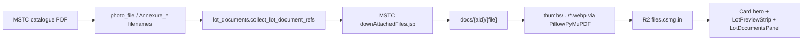
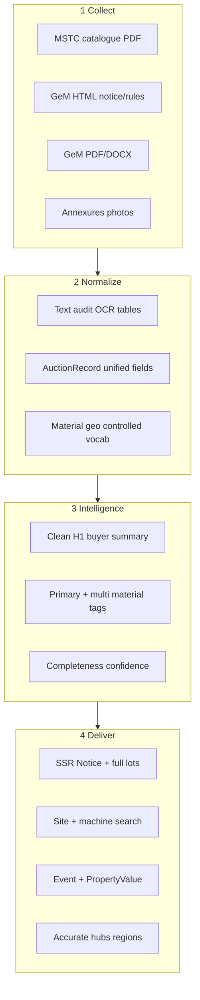

# Listing Quality Plan (MSTC + GeM)

# Final Plan: Top-Quality MSTC + GeM Listings

## One-sentence goal

Every open MSTC and GeM auction page should read like a complete industrial product listing—**material, quantity, condition, location, price/EMD, and notice prose in visible HTML**—with PDFs as official downloads, not the only place the truth lives.

---

## What probes proved (Jul 2026)

| | MSTC live | GeM live |
|---|---|---|
| Body text | Lot Description often present; **truncated mid-sentence**; no full NOTICE | **Almost none** — title + PDF |
| Structured fields | Strong when parse works | Thin (title/price) |
| Docs | CDN PDF yes; photos **0**; annexures filename-only | CDN PDF often; no body extract |
| Search/SEO | `search_text` rich in export; UI/schema underuse it | Detail dropped in adapter; `search_text` thin |
| Hubs | Material mismatches; ferrous empty; regions weak | Same hub system |

**Hard bugs already identified**
- GeM: [`adapt_gem_forward_auction`](mstc-auction-listings/scraper/adapters/gem_forward_adapter.py) drops `auction_detail`; no catalogue text in parse-assets.
- MSTC: SEO [`AuctionDetailLots`](mstc-auction-listings/web/src/components/auction-detail-lots.tsx) hides parameters/other/documents sections that discovery [`LotDetails`](mstc-auction-listings/web/src/components/lot-details.tsx) already knows how to show.
- **Photos:** production **Lane Parse Assets** never downloads MSTC lot photos or builds thumbs — UI requires `thumbnail_ready` / `preview_images`, so live cards show empty chrome despite `photo_file` names in JSON.
- Shared: cloaking risk — strings in RSC/`search_text` that never appear in readable DOM.

---

## Pictures: how extraction and display work (current vs plan)

### Intended pipeline (already built, mostly unused in prod)

| Step | Code | What it does |
|---|---|---|
| Extract filenames | [`pdf_parser.py`](mstc-auction-listings/scraper/pdf_parser.py) | Regex on “Lot documents”: `Photo for Lot no N - …`, `Annexure for Lot no N - …` → `photo_file`, `annexure_file` |
| Build portal URLs | [`lot_documents.py`](mstc-auction-listings/scraper/lot_documents.py) + [`config.MSTC_ATTACHMENT_URL`](mstc-auction-listings/scraper/config.py) | Classify photo vs annexure; retry URL variants |
| Download + thumb | [`document_cache.py`](mstc-auction-listings/scraper/document_cache.py), [`thumbnails.py`](mstc-auction-listings/scraper/thumbnails.py) | Save under `web/public/docs/`; WebP ~480px under `thumbs/`; status `thumbnail_ready` |
| Preview list | `update_lot_preview_images()` | Up to 5 ready thumbs → `preview_images[]` |
| CDN | [`raw_store.push_public_media`](mstc-auction-listings/scraper/raw_store.py), [`media_urls.py`](mstc-auction-listings/scraper/media_urls.py) | Upload `docs/` + `thumbs/` + `pdfs/` → `https://files.csmg.in/...` |
| Escape hatch | [`media_backfill.py`](mstc-auction-listings/scraper/media_backfill.py), workflow `pipeline-media-backfill.yml` | Re-process export docs + optional push |

### How the website shows photos

| Surface | Behavior |
|---|---|
| Listing card | [`resolveListingHero`](mstc-auction-listings/web/src/lib/listing-media.ts) — needs `documents[].status=thumbnail_ready` or `preview_images` with media path; else **empty gradient chrome** (source badge + title) |
| Detail | [`LotPreviewStrip`](mstc-auction-listings/web/src/components/lot-documents.tsx) / [`LotDocumentsPanel`](mstc-auction-listings/web/src/components/lot-documents.tsx) — grid of ready thumbs; uncached docs as “Not cached” chips |
| Filename-only | [`lot-details`](mstc-auction-listings/web/src/components/lot-details.tsx) may show `Photo: {photo_file}` text **without** loading the image |
| Counts | “N docs · M photos” only counts **cached** ready media ([`auction-documents.ts`](mstc-auction-listings/web/src/lib/auction-documents.ts)) |

**Contract (runbook):** the listing UI shows **cached** photos only — never hotlinks MSTC portal attachment URLs.

### Why live shows ~0 photos

1. **Production parse lane** ([`pipeline_parse_assets.py`](mstc-auction-listings/scraper/pipeline_parse_assets.py)) parses `photo_file` strings but **does not** call `process_auction_documents` (download/thumb).
2. Legacy [`pipeline_parse.py`](mstc-auction-listings/scraper/pipeline_parse.py) *does* download docs (budget `--max-docs-per-run`, default ~200) — not the scheduled path that feeds today’s site.
3. Promote/scrub clears missing local `docs/`/`thumbs/` refs → `pending_cache` → no hero.
4. Catalogue **PDFs** are on R2; lot **photos** generally are not.

### GeM pictures

- **No yard-photo equivalent** to MSTC `Photo_*` filenames.
- [`attach_gem_documents`](mstc-auction-listings/scraper/gem_forward_documents.py) can attach tender file-list docs (typed as annexure); thumbs only for **PDF page-1**, and only when that path runs (legacy parse — **not** on parse-assets today).
- Premium/archive HTML galleries are a separate product, not scrapauctionindia cards.

### Plan for pictures (committed approach)

1. **Wire media into the production path** — call `process_auction_documents` from parse-assets (or reliably run `media_backfill` after each parse wave) with a clear per-run budget and priority (open auctions with `photo_file` and empty `preview_images` first).
2. **Always push** new `docs/` + `thumbs/` to R2 before/with Update site; absolutize URLs in export.
3. **UI honesty** — if zero ready thumbs, hide photo chrome and show “Photos pending” / omit evidence photo count; never imply photos exist.
4. **Detail gallery** on SEO detail route (not only discovery `LotDetails`) once thumbs exist; Event `image` = first hero thumb.
5. **GeM** — ship catalogue PDF page-1 thumb as card hero when no photos; do not invent yard photos.
6. **KPI** — % of MSTC lots with `photo_file` that reach `thumbnail_ready` on CDN; Telegram photo % after deploy.
7. **Ops** — keep `pipeline-media-backfill` as catch-up for historical inventory (e.g. known broken IDs).

---

## Research-backed design rules (2026)

These update earlier draft assumptions:

1. **HTML beats PDF for commercial queries** — Google can index PDFs, but HTML wins for mobile, schema, recrawl, and AI citation. Pattern: indexable listing page + downloadable PDF ([yacht/PDF→HTML practice](https://socialanimal.dev/blog/yacht-broker-seo-pdf-listings-to-indexable-web-pages/); industrial SEO guidance).
2. **FAQ rich results are gone (May 7, 2026)** — Keep **visible Quick answers** for buyers and AI extraction; FAQPage markup is optional (harmless, useful to non-Google crawlers) but **not** a SERP bet. Invest in content quality, not FAQ schema chasing.
3. **Event schema still matters** — Auctions are time-bound; enrich Event with `description`, `image`, `endDate`, `organizer`, `offers` (floor) per [Google Event docs](https://developers.google.com/search/docs/appearance/structured-data/event). Do **not** claim Merchant Listing eligibility (site is a discovery aggregator, not the seller).
4. **Industrial attributes via `additionalProperty` / PropertyValue** — Map material, grade, qty, unit, PCB group, GST into machine-readable properties that match procurement long-tails ([manufacturing schema 2026](https://manufacturing-seo.agency/blog/schema-markup-guide-manufacturing-industrial)).
5. **Tender intelligence layers** — Collection → Normalization → Intelligence (tag/score) → Delivery. Dumping raw scrape text is not a product; curated structured pages are ([tender pipeline lessons](https://dev.to/saurav_kumar_fd52db212f32/building-a-government-tender-intelligence-system-with-python-lessons-from-the-real-world-3d0n)).
6. **PDF extract routing** — PyMuPDF text-first → page quality audit → OCR at ≥300 DPI only when sparse → pdfplumber/table path for lot grids; confidence flags; never fabricate missing fields ([2026 extract playbooks](https://pdfmux.com/blog/pymupdf-vs-pdfplumber/)).
7. **Local + material long-tails** — Entity-rich body: “fly ash Nashik”, “GI sheets Deoria”, city/state in H1/meta/body ([salvage/local SEO patterns](https://autorecyclingmarketers.com/pages/blog/salvage-yard-seo-rank-google-maps)).
8. **Schema must match visible content** — No hidden keyword bags; expanders OK if content stays in DOM.
9. **Crawl budget** — Slim hub HTML (MSTC hub ~40MB today is hostile); sitemap hygiene; fix empty/broken hubs before adding more landings.
10. **AI Overviews / answer engines** — Prefer clean visible facts + Event/Product-like attributes over PDF-only or markup-only tricks (Google: structured data helps understanding; not a special AI lever by itself).

---

## Definition of done (quality bar)

A listing is **top quality** when all of the following hold:

- **Visible Notice** (or equivalent) with real prose ≥1 sentence from source, in initial HTML.
- **Lots**: each lot has title + description or structured qty/price; MSTC shows all non-empty catalogue sections.
- **Search**: on-site query for distinctive tokens (material, grade, place) finds the auction in top results.
- **SEO**: meta description derived from body; Event `description` non-empty; BreadcrumbList valid.
- **Honesty**: no invented qty/EMD; PDF linked as official source; pending states only when truly pending.
- **Media**: if photos exist in source, thumbs cached and shown; else no empty photo chrome.
- **Hubs**: primary material/region pages include the auction when tags are correct.

**Target KPIs (30 days after P2 ships)**
- GeM: ≥90% of `complete` rows have non-empty `lot_description_text` or Notice body; `listing_only` &lt;10% of open GeM.
- MSTC: ≥95% of parsed-complete rows show Description without mid-sentence hard cut; photo-cache rate tracked.
- Shared: 0 cloaking diffs on golden set (search tokens ⊆ visible/expandable DOM).
- Hubs: ferrous and top material hubs non-empty when inventory exists; region sitemap not empty.

---

## Canonical field contract (both sources)

| Concept | MSTC source | GeM source | Web field |
|---|---|---|---|
| Notice / body | Lot sections + header | `auction_brief` + `auction_detail` + catalogue extract | Notice block + `item_summary` |
| Lot description | `lot_description_text` | detail/PDF prose | `lots[].lot_description_text` |
| Qty / unit | parameters parse | regex / tables | `quantity`, unit |
| Category | Category / Product Type / PCB | category / sub_category | `category` + material tags |
| Price / EMD | PDF structured | rules + detail | existing price/EMD fields |
| Search blob | all sections + docs | brief+detail+extract+lots | `search_text` (must ⊆ visible) |
| Official file | `pdf_url` | `pdf_url` / document_urls | Download CTA only |

---

## 85-point final program

### A. Principles (non-negotiable)

1. HTML-first product page; PDF secondary download.
2. Visible-or-expandable parity with anything used for search/schema.
3. Never invent numbers; null + “verify on portal” when uncertain.
4. One lot-quality bar for SEO detail and discovery UIs.
5. Aggregator honesty in schema (organizer = government seller; site is discovery).
6. Measure coverage per source after every Update site.

### B. P0 — Unblock body text (days)

7. GeM: map `auction_detail` → `lot_description_text` / `item_description`.
8. GeM: always include brief+detail in `search_text`.
9. GeM: stop overwriting rich summary with ≤80-char lot title.
10. Shared: **Notice / What’s being sold** block above lots when body exists.
11. Fix card “Show full notice text” expand (GeM live broken).
12. MSTC: sentence-aware truncation + Read more (fix mid-sentence cuts).
13. MSTC: OCR spacing cleanup pass on section text before export.
14. Adapter/fixture CI: GeM detail non-empty ⇒ adapted description non-empty.
15. Backfill GeM on next parse/deploy for already-enriched IDs.

### C. P1 — Full use of parsed catalogue (MSTC catch-up + GeM UI)

16. SEO detail: render all non-empty MSTC sections (details, parameters, other, documents text).
17. Unify with [`getLotSectionDisplayText`](mstc-auction-listings/web/src/lib/format.ts) / discovery lot patterns.
18. Show GST/TCS/increment/post-bid EMD on detail when parsed.
19. Show inspection window + contacts when present.
20. Prefer Lot Name / Category for H1 over generic “N MT Scrap Lot”.
21. Multi-lot subtitle: top materials + lot count (not only “+39 more”).
22. GeM: per-lot Description parity once body mapped.
23. FAQ Quick answers: pull qty/EMD/what from structured fields + body (content-first; schema optional).
24. Cards: 2–3 line real description under title for both sources.
25. SSR: notice + lot body in initial HTML, not only RSC payload.

### D. P2 — Document intelligence pipeline

**Status (Jul 2026):** In progress / shipping — GeM catalogue extract + MSTC photo hydrate wired into [`pipeline_parse_assets`](mstc-auction-listings/scraper/pipeline_parse_assets.py) (`PARSER_CACHE_VERSION` 4, `PARSE_ASSETS_MAX_DOCS`); taxonomy blob expanded; material hub loading copy fixed. Remaining: annexure prose UI, Event `image`, photo KPI Telegram, historical media_backfill catch-up.

26. GeM catalogue PDF/DOCX extract in [`pipeline_parse_assets`](mstc-auction-listings/scraper/pipeline_parse_assets.py).
27. Route: selectable text → keep; sparse → OCR ≥300 DPI; empty → flag.
28. pdfplumber/table extract for GeM lot grids when present.
29. Merge HTML detail + PDF (prefer item prose from HTML; tables/qty from PDF); strip T&C boilerplate.
30. Cap body 8–20k chars with head + lot-table preference (export size).
31. `attach_gem_documents` on parse-assets path.
32. Annexure PDF text extract (MSTC + GeM), capped, into `search_text` + expandable “Annexure notes”.
33. **Photos (MSTC):** wire `process_auction_documents` into parse-assets **or** mandatory `media_backfill` after parse; priority queue = open lots with `photo_file` and empty `preview_images`.
34. Generate WebP thumbs; push `docs/` + `thumbs/` to R2; absolutize to `files.csmg.in` before export scrub.
35. UI: card hero + SEO detail gallery from `thumbnail_ready` only; drop empty photo chrome when count is 0; evidence line matches reality.
36. Event JSON-LD `image` = first hero thumb when ready.
37. GeM: catalogue PDF page-1 thumb as hero fallback; no fake yard photos.
38. KPI + Telegram: % of `photo_file` lots that are `thumbnail_ready` on CDN; use media-backfill workflow for historical catch-up.
39. Cap per-run downloads (budget) so parse timebox survives; resume unfinished photo queues next wave.
40. Persist doc status (`pending_cache` / `failed` / `thumbnail_ready`) visibly for ops, not silent empty cards.

### E. Intelligence layer — titles, materials, geo

41. Controlled material vocabulary (ferrous, aluminium, copper, e-waste, vehicle, fly ash, land, mixed…).
42. MSTC: feed Category / Product Type / PCB / parameters into taxonomy (not title-only regex).
43. Primary material = dominant tonnage/value; support multi-tags for mixed lots.
44. Fix known mismatches (e.g. mixed scrap labeled aluminium).
45. GeM: classify from detail+PDF+portal category; normalize condition phrases.
46. Clean H1: item/material first; seller/auctioneer in meta only.
47. Buyer one-liner: “{qty} {material} · {place} · closes {date}”.
48. State/district/pincode normalization for region hubs (GeM strong; MSTC `lot_state`).
49. Completeness score drives parse priority and UI badges (minimal/partial/complete).

### F. Search & machine layer

50. Rebuild `search_text` uniformly for GeM to include all body sources (MSTC [`build_search_text`](mstc-auction-listings/scraper/merger.py) already includes sections — keep that contract).
51. Boost lot description/parameters/category in [`search.ts`](mstc-auction-listings/web/src/lib/search.ts) above bare filenames.
52. Mid-tier lot match includes parameters/other/documents text.
53. Align machine [`searchTextFrom`](mstc-auction-listings/web/scripts/generate-machine-layer.mjs) with export richness.
54. Filters: material + state + qty band backed by structured fields.
55. Golden search queries per material/geo must recall known fixtures.

### G. SEO & discoverability (updated for 2026)

56. Meta description from real body (~155 chars), material + place + close.
57. Event JSON-LD: non-empty `description`, `endDate`, `organizer` (seller), `image` when photo exists, floor `offers` with honest availability.
58. Per-lot or auction-level `additionalProperty` for material, qty, unit, grade/PCB (visible table mirrors schema).
59. ItemList: include short lot blurb/qty where payload allows.
60. BreadcrumbList kept accurate (source → material/region → listing).
61. FAQPage: optional mirror of Quick answers for non-Google agents — **not** required for Google rich results post–May 2026.
62. Prefer Event (+ attributes) over Merchant Product claims (not the merchant).
63. Fix hubs: ferrous empty/loading, regions 404, empty state sitemap, root sitemap/robots if in scope.
64. Slim oversized hub payloads for crawl budget.
65. Internal links from material/region/closing-soon using body keywords.
66. Long-tail landing content unique per hub (avoid doorway thin pages).
67. Optional files-CDN `X-Robots-Tag` so HTML wins as primary index URL.
68. Search Console: monitor coverage, soft 404s, Event enhancements; sample AI Overview citations for material+city queries.

### H. UX polish & trust

69. PDF CTA labeled “Official catalogue PDF” — not “full description”.
70. Pending enrichment copy only when `deep_enrichment_pending` / parse incomplete.
71. Mobile disclosure: keep expanded text in DOM for crawlers where feasible.
72. Alt text on photos from lot title/material.
73. Disclaimer retained; deep links to GeM/MSTC portal for bidding.
74. No bid CTAs that imply on-site bidding (existing no-bid policy).

### I. Ops, QA, rollout gates

75. Golden set: 50 MSTC + 50 GeM — DOM token assertions from fixtures.
76. [`qa_summary`](mstc-auction-listings/scraper/qa_summary.py): missing-body %, truncate %, photo-cache %, GeM listing_only %, material-mismatch sample.
77. Publishable/deploy warn if body-coverage regresses beyond threshold.
78. Parse priority queue: shells → thin descriptions → OCR fails → annexure/photo pending.
79. Timebox: HTML/structured first; OCR/annexure/photo secondary with caps.
80. Telegram after Update site: MSTC/GeM body coverage %, photo %, hub health.
81. Legal/QA: OCR low-confidence pages flagged, not auto-published as complete.
82. Accessibility pass on Notice + lot expanders.
83. Before/after recall test on 20 material+city queries.

### J. Stretch (after P3 stable)

84. LLM structuring only on low-confidence extracts — constrained JSON schema, null if missing, never free invent.
85. Indic OCR path for vernacular annexures if volume justifies (Bhashini/Tesseract Indic).
86. Watchlist alerts when new lots match saved material+geo from body tags.
87. Historical sold/archive pages reuse same body contract (offline GeM archive already extracts text — wire carefully).
88. Continuous golden-diff in CI on every adapter/UI change.

---

## Phased roadmap

| Phase | Scope | Outcome |
|---|---|---|
| **P0** | Points 7–15 | GeM body appears; MSTC stops butchering sentences; Notice UI live |
| **P1** | 16–25 | Full catalogue sections on SEO pages; card/FAQ truthfulness |
| **P2** | 26–40 | GeM PDF/DOCX text + MSTC photo download/thumbs/R2 + annexures |
| **P3** | 38–65 | Taxonomy, search, Event/attributes, hubs crawl-worthy |
| **P4** | 66–80 | KPIs, gates, Telegram — quality stays high |
| **Stretch** | 81–85 | LLM assist, alerts, archive parity |

**Do not** start Stretch before P2 KPIs move. **Do not** chase FAQ rich results. **Do** ship P0 even if PDF OCR is not ready—HTML `auction_detail` alone fixes most GeM emptiness.

---

## Key files to touch (when executing)

- GeM: [`gem_forward_adapter.py`](mstc-auction-listings/scraper/adapters/gem_forward_adapter.py), [`gem_forward_parser.py`](mstc-auction-listings/scraper/gem_forward_parser.py), [`pipeline_parse_assets.py`](mstc-auction-listings/scraper/pipeline_parse_assets.py), [`gem_scrap_samples_fetch.extract_pdf_text`](mstc-auction-listings/scraper/gem_scrap_samples_fetch.py)
- MSTC: [`pdf_parser.py`](mstc-auction-listings/scraper/pdf_parser.py), [`merger.py`](mstc-auction-listings/scraper/merger.py), [`display_enrichment.py`](mstc-auction-listings/scraper/display_enrichment.py)
- Web: [`auction-detail-lots.tsx`](mstc-auction-listings/web/src/components/auction-detail-lots.tsx), [`auction-detail-page-app.tsx`](mstc-auction-listings/web/src/components/auction-detail-page-app.tsx), [`lot-details.tsx`](mstc-auction-listings/web/src/components/lot-details.tsx), [`search.ts`](mstc-auction-listings/web/src/lib/search.ts), [`json-ld.ts`](mstc-auction-listings/web/src/lib/seo/json-ld.ts), [`meta.ts`](mstc-auction-listings/web/src/lib/seo/meta.ts)
- QA: [`qa_summary.py`](mstc-auction-listings/scraper/qa_summary.py), fixtures under `tests/` / GeM HTML fixtures

---

## Explicit non-goals (keeps quality high)

- Becoming a bid portal or claiming to sell inventory.
- Merchant Center / Google Shopping as primary path.
- Replacing MSTC structured parse with raw PDF dump.
- Indexing full multi-megabyte annexures untruncated into `auctions.json`.
- Building new hubs before fixing empty/broken ones.

---

Probe complete. **Execute when you say go** — recommended start: **P0 only**, deploy, verify live GeM Notice + MSTC truncate fix, then continue P1→P2.
